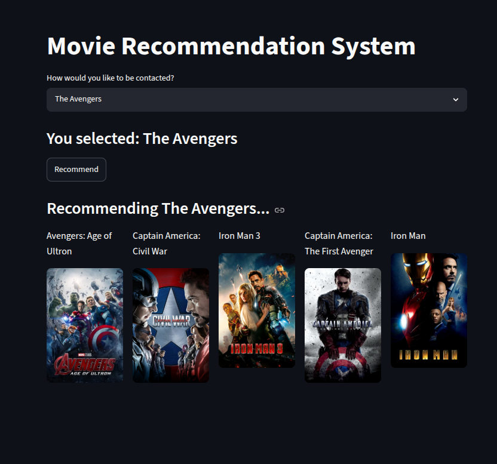
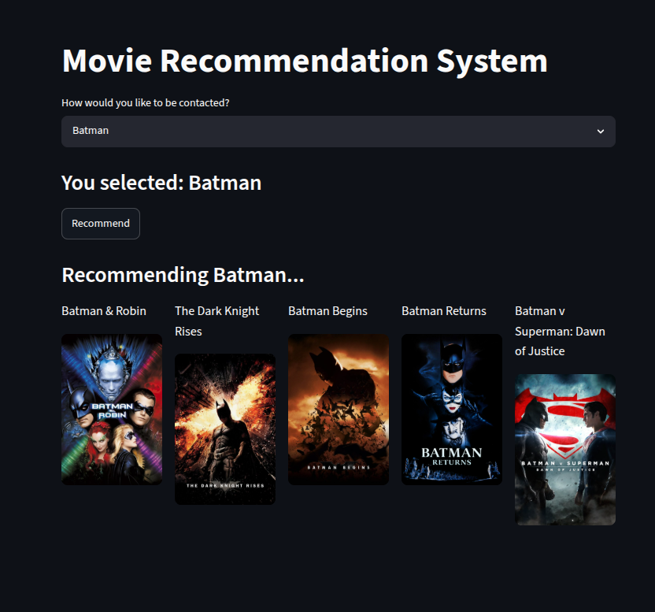
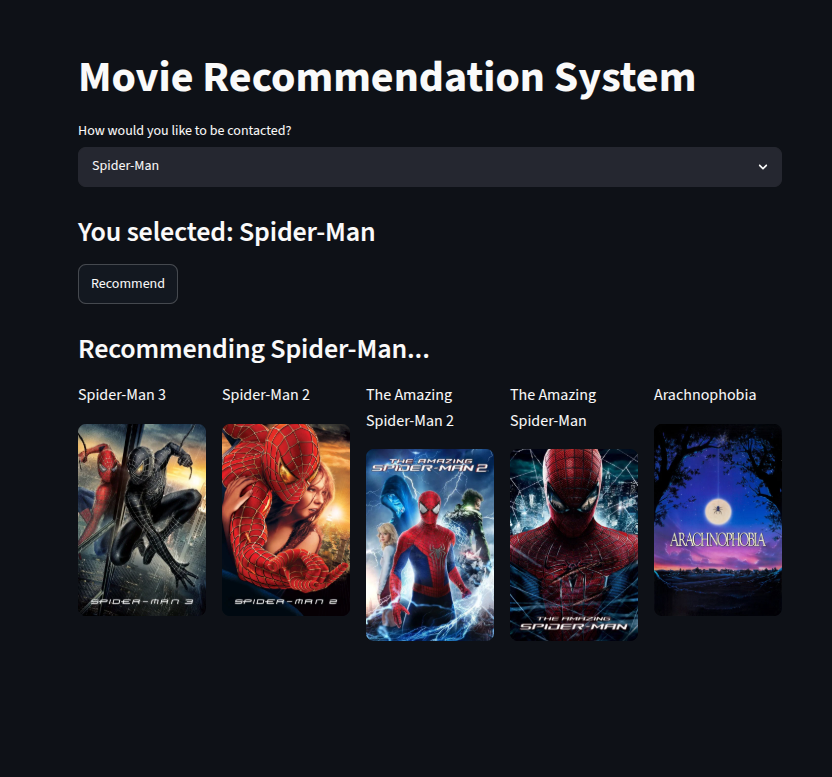

# 🎬 Machine Learning Movie Recommendation Engine

<p align="center">
  
  
  
  
  
  
</p>

## 📌 What is this Project?
In an era of information overload, finding the right content can be overwhelming for users. Recommendation systems are information filtering algorithms designed to predict user preferences and surface highly relevant items. 

This project is an end-to-end Machine Learning pipeline and interactive web dashboard designed to solve the content discovery problem. It utilizes a **Content-Based Filtering** approach, analyzing unstructured metadata (genres, keywords, cast, and crew) to evaluate mathematical similarities between movies and generate accurate recommendations.

---

## 📸 Proof of Concept: Recommendations
Below are actual outputs from the engine when querying highly popular cinematic franchises. The model successfully clusters mathematically similar movies based on semantic metadata.

### 🦸‍♂️ Avengers Movie Query



### 🦇 Batman Movie Query



### 🕷️ Spiderman Movie Query



---

## 🛠️ Tech Stack & Tools Used
* **Programming Language:** Python
* **Web Framework & UI:** Streamlit
* **External API & Image Fetching:** TMDB API (The Movie Database)
* **Data Manipulation & Analysis:** Pandas, NumPy
* **Natural Language Processing (NLP):** NLTK (Natural Language Toolkit)
* **Machine Learning Engine:** Scikit-Learn (`CountVectorizer`, `cosine_similarity`)
* **Serialization:** Pickle (for model deployment)

### Applying Vector Space Modeling (Bag of Words)
To allow the machine learning model to understand text, the textual data (tags) was converted into numerical vectors. Using a maximum of 5,000 frequent features, the algorithm maps out every movie into a high-dimensional vector space, establishing mathematical coordinates for each film based on its characteristics.

---

## 🧠 Machine Learning Architecture & Engineering
To accurately capture the nuanced similarities between thousands of films, I deployed a strict data engineering and NLP pipeline:

1. **Feature Engineering (Tag Aggregation):** Standard datasets contain fragmented columns. The data was engineered by merging `overview`, `genres`, `keywords`, `cast` (top 3 actors), and `crew` (Director) into a single, comprehensive `tags` corpus.
2. **NLP Stemming:** Text data varies wildly in suffix forms (e.g., "action", "actions"). Using the PorterStemmer algorithm, all words were reduced to their root semantic forms to ensure computational efficiency and prevent redundant feature extraction.
3. **Cosine Similarity Matrix:** Rather than measuring the Euclidean distance between movie vectors (which is susceptible to document length variations), the engine calculates the cosine of the angle between vectors. This strictly measures the directional similarity, outputting a strict `0` to `1` similarity score.

---

## 📊 Evaluation Criteria & Model Judgment
In content-based recommendation engines, success is measured by the semantic relevance of the outputted items relative to the input item. The model was evaluated based on the following:
* **Cosine Similarity Score Distribution:** Ensuring the model can confidently distinguish between a highly relevant match (score > 0.6) and a poor match.
* **Contextual Alignment:** How accurately the model maintains the genre, director style, and thematic elements of the source movie.

### Comparative Analysis: The "Content Bubble" Reality Check
Rather than claiming this engine perfectly understands human emotion, this project documents the mathematical reality of Content-Based Filtering. As visualized in the dashboard, the model successfully learns the metadata profile and returns highly accurate, context-aware suggestions. However, it exhibits the classic **"Content Bubble"** limitation—it strictly recommends items highly similar to what the user already knows, lacking the serendipitous discovery provided by Collaborative Filtering (which analyzes diverse user behavior).

---

## 🚀 Installation & Detailed Usage

Follow these step-by-step instructions to get a copy of the project up and running on your local machine for development and testing purposes.

### 1. Prerequisites
Ensure you have Python 3.8 or higher installed on your system. You can verify your version by running:
```bash
python --version
```

### 2. Clone the Repository
Clone this repository to your local machine using the following commands:
```bash
git clone [https://github.com/your-username/movie-recommendation-system.git](https://github.com/your-username/movie-recommendation-system.git)
cd movie-recommendation-system
```

### 3. Set Up a Virtual Environment (Recommended)
It is highly recommended to isolate your project dependencies using a virtual environment:

On windows
```bash
python -m venv env
.\env\Scripts\activate
```

On macOS/Linux
```bash
python3 -m venv env
source env/bin/activate
```

### 4. Install Project Dependencies
Install all required libraries using the provided ⁠requirements.txt⁠ file:
```bash
pip install -r requirements.txt
```

### 5. Obtain a TMDB API Key
To dynamically fetch high-quality movie posters, this application integrates with The Movie Database (TMDB) API.

1. Go to The Movie Database (TMDB) and create a free account.

Navigate to your account settings and request an API Key under the "API" section.

Open your project files (such as ⁠app.py⁠) and look for the API key variable to replace it with your unique key:

```bash
api_key = "YOUR_TMDB_API_KEY_HERE"
```

### 6. Run the Application
Launch the interactive Streamlit dashboard using your terminal:

```bash
streamlit run app.py
```
Once executed, the application will automatically spin up a local web server and open the interface in your default web browser (typically at ⁠http://localhost:8501⁠).

---

## 🎯 Conclusion
This Machine Learning Movie Recommendation Engine demonstrates a robust application of Natural Language Processing (NLP) techniques applied to real-world metadata filtering and content discovery.
Key Takeaways & Project Highlights:
 End-to-End MLOps Pipeline: Successfully bridges a backend machine learning pipeline (leveraging ⁠Scikit-Learn⁠ and text vectorization frameworks) with an intuitive, clean, and interactive user dashboard via ⁠Streamlit⁠.
 Advanced Text Processing: Utilizes the Porter Stemmer algorithm alongside ⁠CountVectorizer⁠ to effectively mitigate vocabulary sparsity and create clean, dense feature matrices from highly noisy text inputs.
 Production-Ready Engineering: Integrates asynchronous external API requests to TMDB to dynamically pull visual artwork at runtime, offering an engaging user experience without dragging down computational efficiency.
Ultimately, this project stands as a complete proof of concept for constructing modular, reproducible, and highly performant machine learning applications designed to optimize content relevance and solve the modern information filtering problem.

---

## 📬 Let's Connect!

I enjoy discussing Data Science, Machine Learning, and innovative tech projects. Whether you have a question about this model, some feedback, or just want to connect, feel free to reach out!

<br>

**Subhadip Biswas**

[](mailto:subhadip2622@gmail.com)

[](https://github.com/Subhadip-cloudCoder)

[](https://x.com/subhadipcodes?s=11)

[](https://www.linkedin.com/in/https://www.linkedin.com/in/subhadip-biswas-ba0a5a419)

<br>

<p align="center">

  <b>⭐️ If you found this project helpful or interesting, please consider giving it a star! ⭐️</b>

</p>